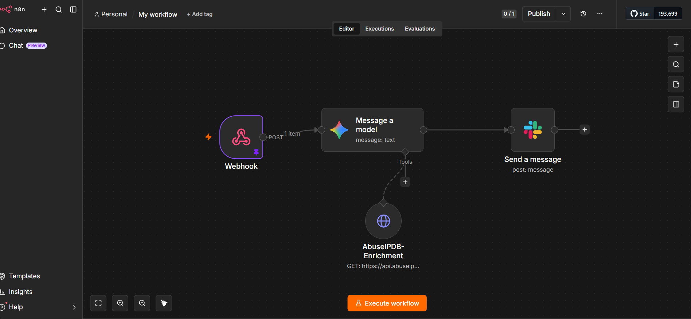
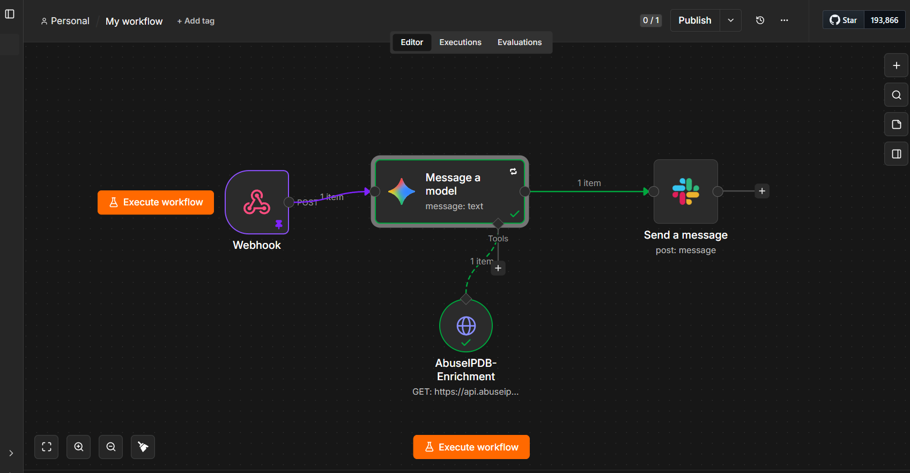
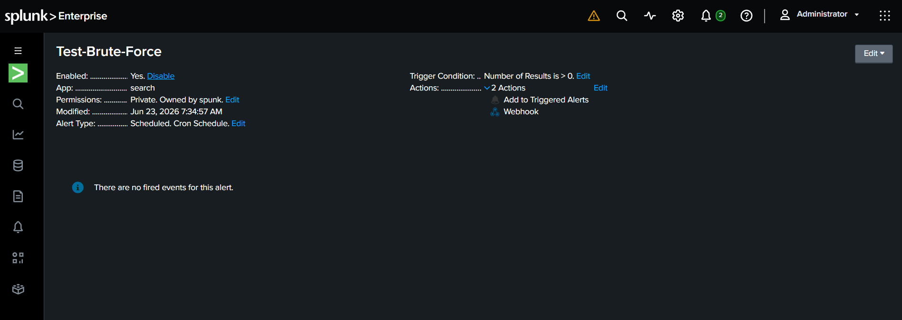
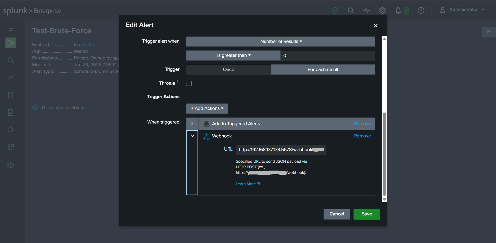
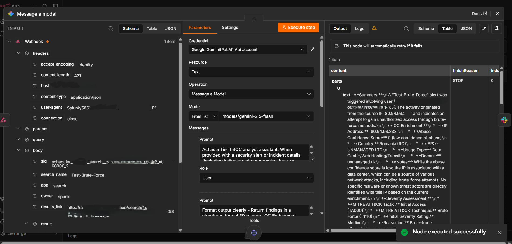
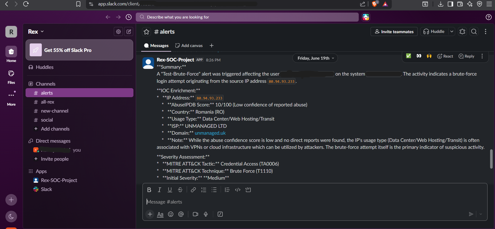

# AI-SOC-Automation
AI-powered SOC alert triage automation using Splunk, n8n, Gemini AI and Slack.
# AI-Powered SOC Alert Triage Automation

## Overview

This project automates Security Operations Center (SOC) alert triage using Splunk, n8n, Google Gemini AI, AbuseIPDB, and Slack.

When a Splunk alert is triggered, the workflow automatically:

* Receives the alert through a webhook
* Enriches indicators using AbuseIPDB
* Uses Gemini AI to analyze the security event
* Maps findings to MITRE ATT&CK techniques
* Assigns a severity level
* Generates investigation recommendations
* Sends results to a Slack alert channel

This reduces manual triage effort and provides analysts with actionable intelligence.

---

## Architecture

Windows 10 Endpoint → Splunk Enterprise → Alert Rule → Webhook → n8n → AbuseIPDB → Gemini AI → Slack

---

## Tools Used

* Splunk Enterprise
* Windows 10
* n8n
* Google Gemini API
* AbuseIPDB
* Slack
* VMware Workstation

---

## Workflow

1. Security events are generated on a Windows endpoint.
2. Splunk detects suspicious activity using a scheduled alert.
3. The alert triggers a webhook action.
4. n8n receives the alert payload.
5. AbuseIPDB enriches the source IP address.
6. Gemini AI analyzes the event.
7. MITRE ATT&CK mappings and severity assessments are generated.
8. Results are sent to Slack for analyst review.

---

## Screenshots

### n8n Workflow

### Splunk Alert Configuration

### Webhook Configuration

### Gemini Analysis

### Slack Notification

---

## Key Features

* Automated alert triage
* IOC enrichment
* AI-assisted investigation
* MITRE ATT&CK mapping
* Slack notifications
* SOC workflow automation

---

Kshitij Poojari
SOC Analyst | Splunk | SIEM | Threat Detection | Security Automation
